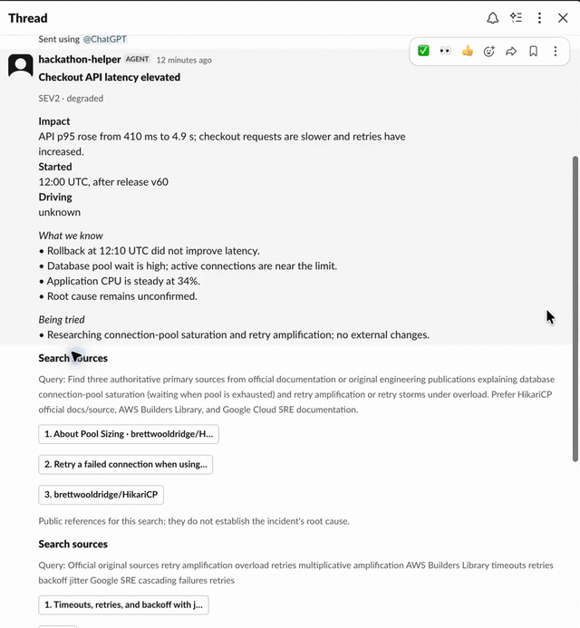

# Creative Studio in Slack

**OpenAI + CopilotKit Channels + Exa**

Build an agent that reads an existing conversation and attached product image,
chooses a creative route, and replies in the same Slack thread with native
progress cards. Ask for a product launch, UGC concept, poster system, or deck
outline; the same operator can keep moving without a checkpoint for every
routine creative step.

[](../../assets/demos/slack.mp4)

_The live path posts “Creative Studio is on it”, then reports received,
researching, creating, drafting, preparing, and complete transitions._

## Get started

Complete the [root clone/install steps](../../README.md#get-started), then configure `.env` with [OpenAI](../../using-sponsor-tools.md#openai), [CopilotKit Intelligence](../../using-sponsor-tools.md#copilotkit), and [Exa](../../using-sponsor-tools.md#exa):

```dotenv
MODEL_PROVIDER=openai
OPENAI_API_KEY=your-key
MODEL=gpt-5.6-sol
CHANNEL_CODE=your-channel-code
INTELLIGENCE_API_KEY=your-project-key
EXA_API_KEY=your-key
EXA_SEARCH_TYPE=fast
```

Choose an OpenAI model available to your account. Start the official onboarding handoff:

```bash
npm run channel:setup -- --no-clipboard
```

This installs the maintained `channels-setup` skill and prints a prompt. Give that prompt to your coding agent in this checkout and specify **Slack**, using the existing `apps/channel` app. Have the agent follow the skill through sign-in, project/Channel configuration, Slack installation, and a real reply. The command alone does not create the Channel. Keep existing `.env` values; the listener reads `CHANNEL_CODE` and `INTELLIGENCE_API_KEY`. The [shared onboarding notes](../../README.md#copilotkit-onboarding) explain CLI credential naming; the [setup guide](../../dev-docs/setup.md) and [screenshot walkthrough](../../dev-docs/channels-sdk-walkthrough/README.md) provide manual reference.

```bash
npm run dev:slack
```

Invite the bot to a Slack channel and mention it with a product image and brief.
CopilotKit Intelligence manages the Slack connection; this listener needs no
public tunnel or Slack app token on the managed path.

## Try the flow

1. Attach the bottle screenshot or another product image to a Slack message.
2. Mention the agent: “Turn this into a cobalt-blue energy-drink launch with a
   hero, 10-second UGC, posters, and a deck for my boss.”
3. Watch the native progress cards and tool-status indicator in the same thread.
4. If Exa is configured, ask for visual references; results may include source
   pages and image links. A video result is a page/URL, not a video file.

Routine research, drafting, and creative direction remain autonomous. Keep an
explicit human boundary only for public publishing, customer-facing sends,
payments, or other consequential actions.

## Customize these files

| Piece | File |
|---|---|
| Agent and model | [Shared agent factory](../../packages/agent-core/src/agent.ts), using CopilotKit's built-in agent |
| Channel lifecycle | [src/channel.tsx](src/channel.tsx): mention, subscribe, multimodal prompt, progress post |
| Channel-only run adapter | [src/agent.ts](src/agent.ts): keeps outer transcript/state while using fresh inner agent runs |
| Thread context and research | [src/tools.tsx](src/tools.tsx) and [src/search.tsx](src/search.tsx): thread context and Exa-backed visual/source search |
| Native cards | [src/components.tsx](src/components.tsx): `creative_progress` and reusable Channels JSX |
| Prompt | [Shared prompt](../../packages/agent-core/src/prompt.ts) |

OpenRouter can be used as the model gateway through the shared provider settings in [using-sponsor-tools.md](../../using-sponsor-tools.md#openrouter). Teams or another messaging platform can reuse the Channels pattern, but this starter app is wired for managed Slack.

## Give this to your coding agent

```text
Read the root hackathon overview, rules, sponsor guide, and AGENTS.md.
Read .agents/skills/build-channels-agent/SKILL.md before changing Slack code.
If Slack is not connected, run npm run channel:setup -- --no-clipboard
from the repository root and follow its prompt using the channels-setup
skill. Select Slack and connect the existing apps/channel app.
Adapt apps/channel to our project's user and conversation. Preserve
read_thread, use Exa when research helps, and render results with Channels JSX.
Preserve multimodal content parts, `creative_progress`, and the fresh agent per
thread. Demonstrate that the attached reference and earlier messages change
the creative route and that progress stays in the same thread.
Run npm run verify and document the live Slack checks separately.
```

## Verify and limits

Run `npm run verify` for root/channel typechecks and offline tests. Live Slack delivery, Exa search, and model responses require your own accounts and should be documented separately from local tests.

Keep the pinned Channels/runtime pair and the `@ag-ui/client` override. The [Channels skill](../../.agents/skills/build-channels-agent/SKILL.md) supplies the verified API vocabulary. [Channels guide](https://copilotkit.ai/channels-guide.md) · [OpenTag reference app](https://github.com/CopilotKit/OpenTag)
